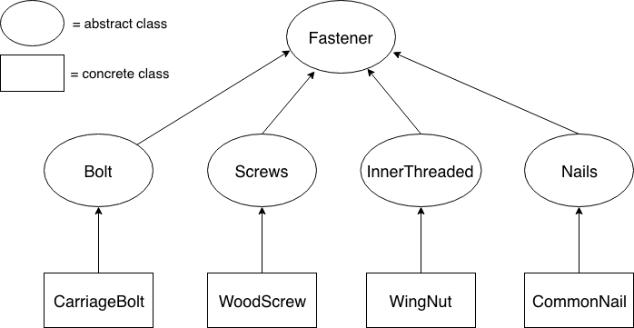

This hierarchy is based on the Wood Screw, Wing Nut, Common Nail, and Carriage Bolt in this [hierarchy of Fasteners](https://www.fastenal.com/products/fasteners?r=~|categoryl1:%22600000%20Fasteners%22|~).

To run FastenerOrderSystem you must first run TestHierarchy as this builds the database that FastenerOrderSystem uses.

You may have to add JUnit 5 library to the build path to test the classes.

The following classes were created by my professor: FastenerOrderSystem, TestHierarchy

Below is a diagram of how my hierarchy works.

